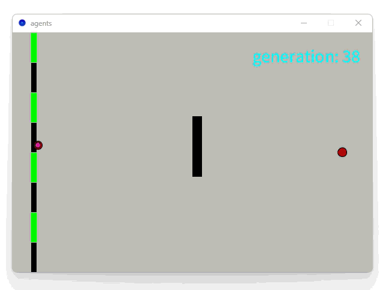
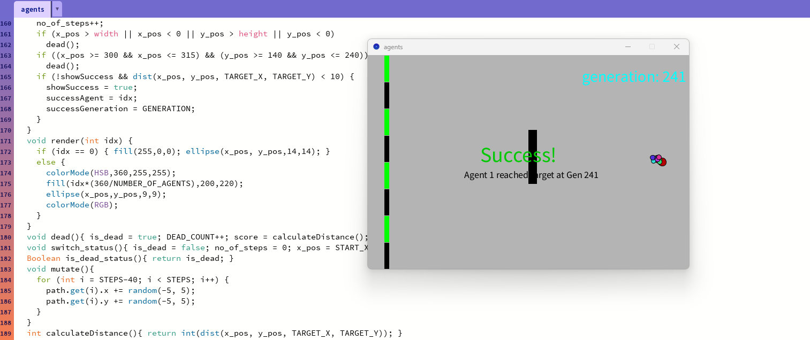
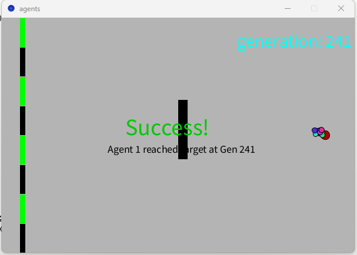

# Fun Intro to Genetic Algorithms 🧬

A fascinating pathfinding simulation where little agents teach themselves to navigate around obstacles using the power of evolution!



## 🎯 What is this?

While Genetic Algorithms (GAs) are a foundational concept in machine learning, I've always been fascinated by their elegant simplicity. To get my hands dirty again, I recently built this fun pathfinding simulation where little agents teach themselves how to navigate a maze.

It got me thinking: **What if you could solve complex problems by mimicking nature's oldest and most powerful trick: evolution?**

That's the core idea behind Genetic Algorithms. This project demonstrates what a GA is, breaks down its core components, and shows how I used one to teach agents to find the best path through a simple maze.

## 🔬 How It Works

### The Setup
- **Agents**: 10 yellow circular agents start at the left side of the screen
- **Target**: Red circle on the right side that agents need to reach
- **Obstacle**: Black barrier that agents must navigate around
- **Goal**: Find the optimal path from start to target while avoiding obstacles

### The Evolution Process

1. **Initialization**: Each agent gets a random path (sequence of movement vectors)
2. **Simulation**: Agents follow their paths simultaneously
3. **Selection**: The agent that gets closest to the target becomes the "fittest"
4. **Reproduction**: All agents inherit the best path as their base
5. **Mutation**: Each agent's path gets slightly randomized
6. **Repeat**: The cycle continues, with each generation getting better

 

### Key Genetic Algorithm Components

- **Population**: 10 agents per generation
- **Genome**: Each agent's path (300 movement steps)
- **Fitness Function**: Distance to target (lower = better)
- **Selection**: Best performing agent becomes the parent
- **Mutation**: Random variations added to movement vectors
- **Crossover**: Not implemented in this simple version

## 🚀 Getting Started

### Prerequisites
- [Processing IDE](https://processing.org/download/) (version 3.0 or higher)

### Running the Simulation
1. Clone this repository:
   ```bash
   git clone https://github.com/PinsaraPerera/Fun-Intro-to-Genetic-Algorithms.git
   ```
2. Open `agents.pde` in Processing IDE
3. Click the "Run" button or press `Ctrl+R`
4. Watch the magic happen! 🎭

### What You'll See
- Yellow dots (agents) moving from left to right
- A generation counter showing evolutionary progress
- Agents getting progressively better at avoiding the obstacle
- Eventually, agents will find efficient paths around the barrier

## 🎛️ Customization

You can tweak various parameters to experiment:

```processing
int NUMBER_OF_AGENTS = 10;     // Population size
int STEPS = 300;               // Path length (genome size)
float TARGET_X = 550;          // Target position
float TARGET_Y = 200;
```

### Try These Experiments:
- **Increase population size**: More diversity but slower evolution
- **Adjust mutation rate**: Change the random range in the `mutate()` function
- **Move the obstacle**: Modify the barrier position in `draw()`
- **Add more obstacles**: Create a more complex maze

## 🧠 Learning Outcomes

This simulation demonstrates key concepts:

- **Emergent Behavior**: Complex pathfinding emerges from simple rules
- **Natural Selection**: Better solutions naturally dominate
- **Genetic Drift**: Random mutations can lead to improvements
- **Convergence**: Population gradually focuses on optimal solutions

## 🔧 Technical Details

### Core Classes
- **Agent**: Represents individual organisms with position, path, and fitness
- **DrawLine**: Handles the visual starting line indicator

### Key Functions
- `set_best_agents_path()`: Selection and inheritance mechanism
- `mutate()`: Introduces random variations
- `calculateDistance()`: Fitness evaluation

### Evolution Strategy
This implementation uses a **(1+λ)-ES** evolution strategy:
- Single parent (best agent)
- Lambda offspring (all other agents)
- Elitist selection (best always survives)

## 🎯 Future Enhancements

- [ ] Implement crossover between multiple parents
- [ ] Add dynamic obstacles
- [ ] Implement different selection strategies (tournament, roulette wheel)
- [ ] Add real-time parameter adjustment
- [ ] 3D environment navigation
- [ ] Multi-objective optimization (speed + efficiency)

## 🤝 Contributing

Feel free to experiment and improve! Some ideas:
- Add new obstacle types
- Implement different mutation strategies
- Create more complex fitness functions
- Add visualization of the evolutionary process

## 📚 Learn More

Want to dive deeper into Genetic Algorithms?
- [Introduction to Genetic Algorithms](https://en.wikipedia.org/wiki/Genetic_algorithm)
- [Processing Documentation](https://processing.org/reference/)
- [Evoluation of Code (The coding train)](https://youtu.be/9zfeTw-uFCw?si=WmWqwNFC_gPlAIS1)

## 📄 License

This project is open source and available under the [MIT License]().

---

**Happy Evolving!** 🧬✨

*Built with ❤️ using Processing*